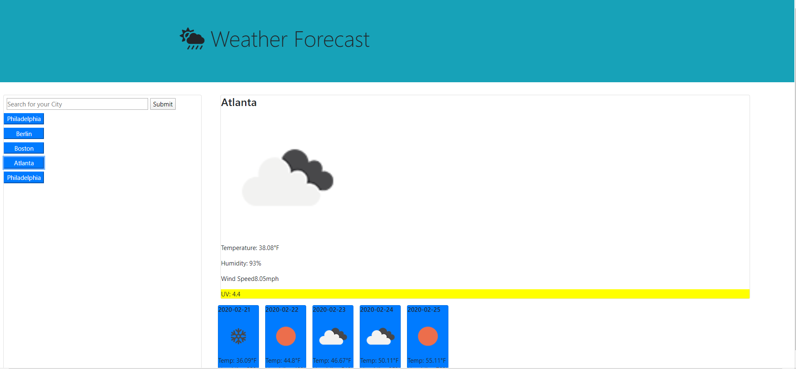

# Weather Forecast:

This app allows the user to search for a city of interest and display its current weather and a five day forecast. The code makes use of various APIs provided by OpenWeatherMap to provide temperatures, humidity, windspeed, UV index, as well as icons representing the general conditions. The app will store and display the 5 most recent searches on buttons which can be used to call a new search on those cities. This information is saved on local storage and will remain through refreshes.

The app is deployed at mattmarnien.github.io/weatherforecast/

# Desktop Screenshot:

